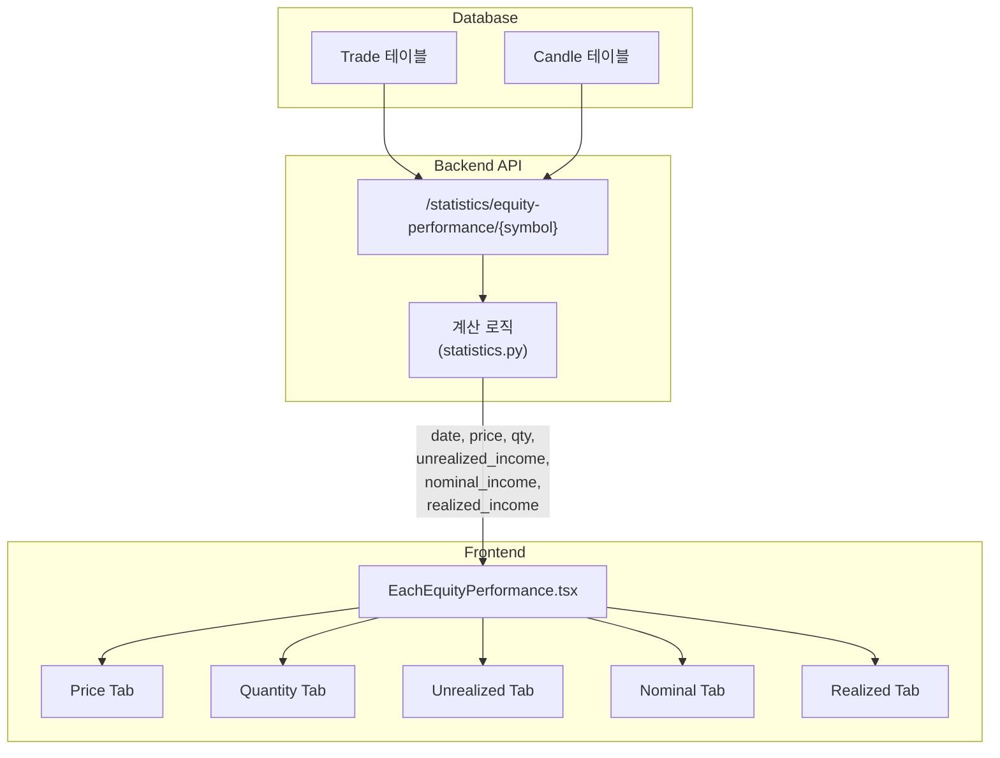

# Performance Graph Technical Documentation

이 문서는 Analysis Live 페이지의 5개 성능 그래프(Price, Quantity, Unrealized Income, Nominal Income, Realized Income)가 어떤 데이터를 사용하고 어떻게 계산되는지 상세히 설명합니다.

---

## 목차

1. [데이터 소스](#데이터-소스)
2. [Price Graph](#1-price-graph)
3. [Quantity Graph](#2-quantity-graph)
4. [Unrealized Income Graph](#3-unrealized-income-graph-미실현-손익)
5. [Nominal Income Graph](#4-nominal-income-graph-총-손익)
6. [Realized Income Graph](#5-realized-income-graph-실현-손익)
7. [데이터 흐름 다이어그램](#데이터-흐름-다이어그램)

---

## 데이터 소스

### DB 테이블

| 테이블 | 용도 |
|--------|------|
| `Trade` | 거래 체결 내역 (symbol, side, qty, price, commission) |
| `Candle` | 일별 시세 데이터 (symbol, timestamp, open, high, low, close) |

### API 엔드포인트

```
GET /api/v1/statistics/equity-performance/{symbol}?period={period}
```

**응답 예시:**
```json
{
  "data": [
    {
      "date": "2025-12-30",
      "price": 452.04,
      "qty": 53.0,
      "unrealized_income": 533.69,
      "realized_income": 537.54,
      "nominal_income": 1071.23,
      "total_bought": 22500.00,
      "total_sold": 3000.00
    }
  ]
}
```

---

## 1. Price Graph

### 설명
해당 종목의 **일별 종가(Close Price)**를 시계열로 표시합니다.

### 데이터 소스
- **테이블**: `Candle`
- **필드**: `close`

### 계산 로직
```python
# statistics.py에서 Candle 데이터 조회
candles = await db.execute(
    select(Candle)
    .where(Candle.symbol == symbol)
    .where(Candle.timeframe == "1d")
    .where(Candle.timestamp >= start_date)
    .order_by(Candle.timestamp.asc())
)

# 각 candle에서 close 가격 추출
for c in candles:
    history_data.append({
        "date": c.timestamp.date().isoformat(),
        "price": c.close,  # 👈 이 값이 Price Graph에 사용됨
        ...
    })
```

### Frontend 구현
```tsx
// EachEquityPerformance.tsx - Price Tab
<LineChart data={data}>
    <Line 
        type="monotone" 
        dataKey="price"  // 👈 API 응답의 "price" 필드
        stroke="#f59e0b" 
        strokeWidth={2}
        name="Stock Price"
    />
</LineChart>
```

---

## 2. Quantity Graph

### 설명
해당 종목의 **보유 수량 변화**를 시계열로 표시합니다. 매수하면 수량 증가, 매도하면 수량 감소.

### 데이터 소스
- **테이블**: `Trade`
- **필드**: `side`, `qty`

### 계산 로직
```python
# statistics.py - 거래별 수량 누적 계산
curr_qty = 0.0

for c in candles:  # 각 날짜별로 순회
    # 해당 날짜까지의 거래 처리
    while trade_idx < num_trades:
        t = trades[trade_idx]
        if t.created_at.date() > c.timestamp.date():
            break
            
        if t.side == 'buy':
            curr_qty += t.qty  # 👈 매수: 수량 증가
        elif t.side == 'sell':
            qty_sold = min(t.qty, curr_qty)
            curr_qty -= qty_sold  # 👈 매도: 수량 감소
            
        trade_idx += 1
    
    history_data.append({
        ...
        "qty": curr_qty,  # 👈 이 값이 Quantity Graph에 사용됨
        ...
    })
```

### Frontend 구현
```tsx
// EachEquityPerformance.tsx - Quantity Tab
<AreaChart data={data}>
    <defs>
        <linearGradient id="colorQty" x1="0" y1="0" x2="0" y2="1">
            <stop offset="5%" stopColor="#8884d8" stopOpacity={0.8}/>
            <stop offset="95%" stopColor="#8884d8" stopOpacity={0}/>
        </linearGradient>
    </defs>
    <Area 
        type="monotone" 
        dataKey="qty"  // 👈 API 응답의 "qty" 필드
        fill="url(#colorQty)"
        name="Holding Quantity"
    />
</AreaChart>
```

---

## 3. Unrealized Income Graph (미실현 손익)

### 설명
**현재 시장가 기준**으로 보유 중인 주식의 손익을 계산합니다. 주가가 변동하면 이 값도 변동합니다.

### 공식
```
Unrealized Income = (현재가 × 보유수량) - (평균매입단가 × 보유수량)
                  = 보유수량 × (현재가 - 평균매입단가)
```

### 데이터 소스
- **테이블**: `Trade`, `Candle`
- **필드**: `Trade.price`, `Trade.qty`, `Trade.commission`, `Candle.close`

### 계산 로직
```python
# statistics.py - 미실현 손익 계산
curr_qty = 0.0
curr_avg_cost = 0.0  # 평균매입단가 (commission 포함)

for c in candles:
    # 거래 처리 로직...
    
    # 👇 Unrealized Income 계산
    current_value = c.close * curr_qty
    unrealized_income = current_value - (curr_avg_cost * curr_qty)
    
    history_data.append({
        ...
        "unrealized_income": unrealized_income,  # 👈 Unrealized Graph에 사용
        ...
    })
```

### Frontend 구현
```tsx
// EachEquityPerformance.tsx - Unrealized Tab
<LineChart data={data}>
    <Line 
        type="monotone" 
        dataKey="unrealized_income"  // 👈 API 응답의 "unrealized_income" 필드
        stroke="#22c55e" 
        strokeWidth={2}
        name="Unrealized P/L"
    />
</LineChart>
```

---

## 4. Nominal Income Graph (총 손익)

### 설명
**총 손익**을 계산합니다. 이는 현재 보유 가치에 과거 판매 금액을 더하고 과거 구매 금액을 빼서 계산합니다.

### 공식
```
Nominal Income = (현재 보유 주식 가치) + (판매한 총 금액) - (구매한 총 금액)
               = current_value + total_sold - total_bought
```

### 데이터 소스
- **테이블**: `Trade`, `Candle`
- **필드**: `Trade.price`, `Trade.qty`, `Trade.commission`, `Candle.close`

### 계산 로직
```python
# statistics.py - 총 손익 계산
Total_bought = 0.0  # 누적 구매 금액 (commission 포함)
total_sold = 0.0    # 누적 판매 금액 (commission 차감)

for c in candles:
    while trade_idx < num_trades:
        t = trades[trade_idx]
        if t.created_at.date() > c.timestamp.date():
            break
            
        if t.side == 'buy':
            buy_cost = t.qty * t.price + t.commission
            total_bought += buy_cost  # 👈 구매 금액 누적
        elif t.side == 'sell':
            sell_revenue = t.price * qty_sold - t.commission
            total_sold += sell_revenue  # 👈 판매 금액 누적
            
        trade_idx += 1
    
    # 👇 Nominal (Total) Income 계산
    current_value = c.close * curr_qty
    nominal_income = current_value + total_sold - total_bought
    
    history_data.append({
        ...
        "nominal_income": nominal_income,  # 👈 Nominal Graph에 사용
        ...
    })
```

### Unrealized vs Nominal 차이
| 항목 | Unrealized Income | Nominal Income |
|------|-------------------|----------------|
| 계산 방식 | 현재가치 - 평균단가×수량 | 현재가치 + 총판매 - 총구매 |
| 실현 손익 포함 | ❌ | ✅ |
| 용도 | 현재 포지션 손익 | 전체 투자 성과 |

### Frontend 구현
```tsx
// EachEquityPerformance.tsx - Nominal Tab
<LineChart data={data}>
    <Line 
        type="monotone" 
        dataKey="nominal_income"  // 👈 API 응답의 "nominal_income" 필드
        stroke="#3b82f6" 
        strokeWidth={2}
        name="Total P/L (Nominal)"
    />
</LineChart>
```

---

## 5. Realized Income Graph (실현 손익)

### 설명
**실제 매도가 발생한 거래에서의 손익**을 누적하여 표시합니다. 주가 변동과 무관하게 매도 시점에 확정됩니다.

### 공식
```
각 매도 거래의 실현 손익 = (매도가 - 평균매입단가) × 매도수량 - Commission
누적 실현 손익 = Σ (각 매도 거래의 실현 손익)
```

### 데이터 소스
- **테이블**: `Trade`
- **필드**: `side`, `price`, `qty`, `commission`

### 계산 로직
```python
# statistics.py - 실현 손익 계산
curr_qty = 0.0
curr_avg_cost = 0.0
curr_realized = 0.0  # 누적 실현 손익

for c in candles:
    while trade_idx < num_trades:
        t = trades[trade_idx]
        if t.created_at.date() > c.timestamp.date():
            break
            
        if t.side == 'buy':
            # 평균매입단가 업데이트 (commission 포함)
            total_val = (curr_qty * curr_avg_cost) + (t.qty * t.price) + t.commission
            curr_qty += t.qty
            if curr_qty > 0:
                curr_avg_cost = total_val / curr_qty
        elif t.side == 'sell':
            qty_sold = min(t.qty, curr_qty)
            # 👇 실현 손익 계산 (Commission 차감)
            pl = (t.price - curr_avg_cost) * qty_sold - t.commission
            curr_realized += pl  # 👈 누적
            curr_qty -= qty_sold
            
        trade_idx += 1
    
    history_data.append({
        ...
        "realized_income": curr_realized,  # 👈 이 값이 Realized Graph에 사용됨
    })
```

### Commission 반영
- **매도 시**: Commission이 실현 손익에서 직접 차감됨
  ```
  실현 손익 = (매도가 - 평균매입단가) × 수량 - Commission
  ```
- **결과**: Commission이 높을수록 실현 손익 감소

### Realized Income의 특징
1. **단조 변화**: 매도가 없으면 값이 변하지 않음 (그래프가 수평)
2. **누적값**: 과거 모든 매도 거래의 실현 손익 합계
3. **확정값**: 매도 후에는 주가 변동과 무관

### Frontend 구현
```tsx
// EachEquityPerformance.tsx - Realized Tab
<AreaChart data={data}>
    <defs>
        <linearGradient id="colorRealized" x1="0" y1="0" x2="0" y2="1">
            <stop offset="5%" stopColor="#ef4444" stopOpacity={0.8}/>
            <stop offset="95%" stopColor="#ef4444" stopOpacity={0}/>
        </linearGradient>
    </defs>
    <Area 
        type="monotone" 
        dataKey="realized_income"  // 👈 API 응답의 "realized_income" 필드
        fill="url(#colorRealized)"
        name="Realized Income (Cumulative)"
    />
</AreaChart>
```

---

## 데이터 흐름 다이어그램



---

## 관련 파일

| 파일 | 역할 |
|------|------|
| [statistics.py](file:///home/tglim/codes/AutoBuySell/api/app/api/statistics.py) | 5개 필드 계산 로직 |
| [EachEquityPerformance.tsx](file:///home/tglim/codes/AutoBuySell/frontend/components/analysis/EachEquityPerformance.tsx) | 5개 탭 그래프 렌더링 |
| [Trade 모델](file:///home/tglim/codes/AutoBuySell/api/app/domain/models.py) | 거래 데이터 스키마 |
| [Candle 모델](file:///home/tglim/codes/AutoBuySell/api/app/domain/models.py) | 시세 데이터 스키마 |

---

## 테스트 데이터 확인

### AAPL (Commission 없음 - Retail Account 시뮬레이션)
```bash
curl http://localhost:8000/api/v1/statistics/equity-performance/AAPL?period=3M | jq '.data[-1]'
```
```json
{
  "date": "2026-01-03",
  "price": 461.99,
  "qty": 53.0,
  "unrealized_income": 1061.04,
  "realized_income": 537.54,
  "nominal_income": 1598.58
}
```

### TSLA (Commission 있음 - Broker API 시뮬레이션)
```bash
curl http://localhost:8000/api/v1/statistics/equity-performance/TSLA?period=3M | jq '.data[-1]'
```
```json
{
  "date": "2026-01-03",
  "price": 294.23,
  "qty": 36.0,
  "unrealized_income": -715.37,
  "realized_income": 122.64,
  "nominal_income": -592.73
}
```

> **참고**: TSLA의 realized_income이 낮은 이유는 각 매도 거래에서 commission이 차감되었기 때문입니다.
