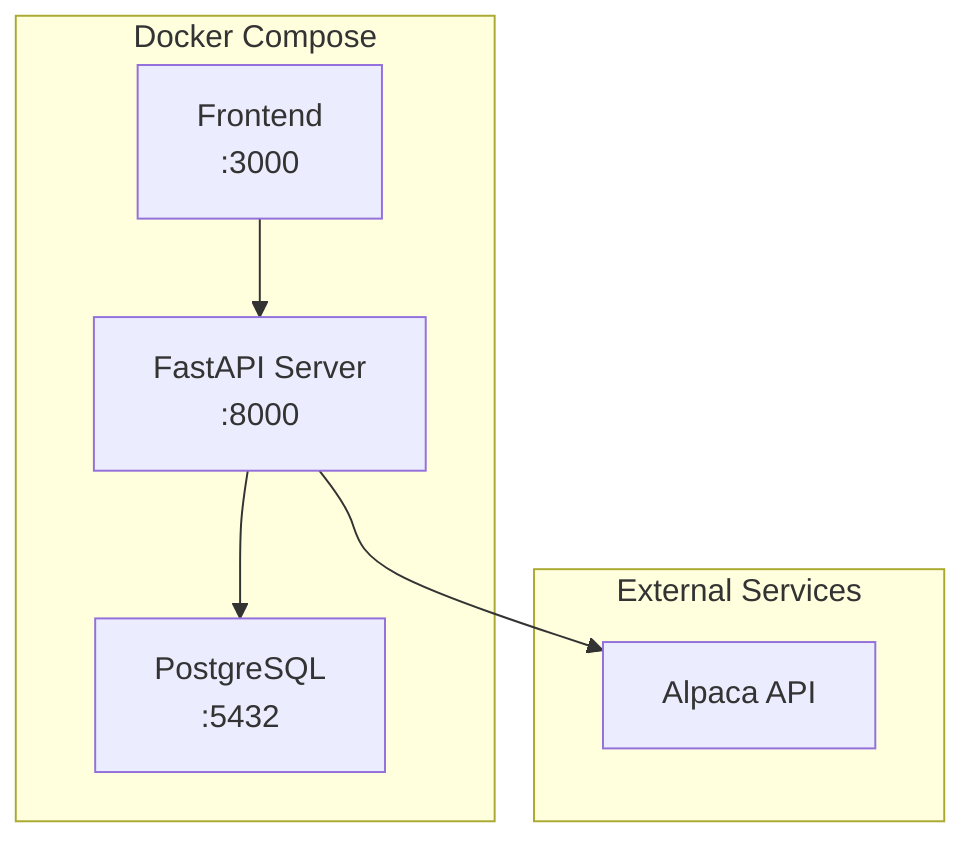

# AutoBuySell 시스템 운영 가이드

이 문서는 AutoBuySell 자동 거래 시스템의 운영 방법을 설명합니다.

## 목차

1. [시스템 아키텍처](#시스템-아키텍처)
2. [서버 시작/중지](#서버-시작중지)
3. [거래 서비스 제어](#거래-서비스-제어)
4. [상태 확인](#상태-확인)
5. [트러블슈팅](#트러블슈팅)

---

## 시스템 아키텍처



### 주요 컴포넌트

| 서비스 | 포트 | 설명 |
|--------|------|------|
| **Frontend** | 3000 | Next.js 기반 웹 UI |
| **API** | 8000 | FastAPI 백엔드, 거래 로직 |
| **PostgreSQL** | 5432 | 데이터베이스 (캔들, 주문, 로그 등) |

---

## 서버 시작/중지

### Docker Compose로 전체 시스템 시작

```bash
cd /home/tglim/codes/AutoBuySell
docker-compose up -d
```

### 서버 중지

```bash
docker-compose down
```

### 로그 확인

```bash
# 전체 로그
docker-compose logs -f

# API 서버 로그만
docker-compose logs -f api
```

---

## 거래 서비스 제어

### 상태 영속화

> [!IMPORTANT]
> 거래 서비스 상태(`is_running`, `active_strategy`)는 **DB에 저장**됩니다.
> 서버가 재시작되어도 자동으로 이전 상태로 복원됩니다.

### API 엔드포인트

| 메서드 | 엔드포인트 | 설명 |
|--------|-----------|------|
| GET | `/api/v1/trading/status` | 현재 상태 조회 |
| POST | `/api/v1/trading/start` | 거래 서비스 시작 |
| POST | `/api/v1/trading/stop` | 거래 서비스 중지 |
| PUT | `/api/v1/trading/strategy` | 활성 전략 변경 |

### 사용 예시

#### 거래 시작
```bash
curl -X POST http://localhost:8000/api/v1/trading/start
```

#### 상태 확인
```bash
curl http://localhost:8000/api/v1/trading/status
```

**응답 예시:**
```json
{
    "is_running": true,
    "next_run": "2026-01-03 14:00:00",
    "active_strategy": "MeanReversion_v1",
    "available_strategies": ["MeanReversion_v1"]
}
```

#### 거래 중지
```bash
curl -X POST http://localhost:8000/api/v1/trading/stop
```

---

## 상태 확인

### 헬스체크

```bash
curl http://localhost:8000/health
# {"status": "ok"}
```

### 계좌 정보

```bash
curl http://localhost:8000/api/v1/trading/account
```

### 포지션 확인

```bash
curl http://localhost:8000/api/v1/trading/positions
```

### 시그널 로그 조회

```bash
curl "http://localhost:8000/api/v1/logs/signals?limit=20"
```

### 시스템/전략 로그 조회

```bash
# 전체 로그
curl "http://localhost:8000/api/v1/logs/?limit=50"

# 시그널 로그
curl "http://localhost:8000/api/v1/logs/signals?limit=50"

# 체결(거래) 로그
curl "http://localhost:8000/api/v1/logs/trades?limit=50"
```

---

## 트러블슈팅

### 거래가 동작하지 않을 때

1. **서비스 상태 확인**
   ```bash
   curl http://localhost:8000/api/v1/trading/status
   ```
   `is_running`이 `true`인지 확인

2. **장 오픈 여부 확인**
   - 미국 주식시장: 동부시간 9:30 AM - 4:00 PM (한국시간 23:30 - 06:00)
   - 장이 닫혀있으면 거래 사이클이 스킵됨

3. **활성 심볼 확인**
   - DB의 `symbols` 테이블에 `is_active = true`인 심볼이 있어야 함

4. **전략 파라미터 확인**
   - `strategy_params` 테이블에 활성 파라미터가 있어야 함

### 시그널이 생성되지 않을 때

시그널이 없는 것은 정상일 수 있습니다:

- **Mean Reversion 전략 조건:**
  - 매수: 최근 고점 대비 5% 이상 하락 + 반등 시작
  - 매도: 최근 저점 대비 5% 이상 상승 + 하락 시작

- 시장이 횡보하거나 조건 미충족 시 시그널이 발생하지 않음

### 데이터베이스 연결 오류

```bash
# PostgreSQL 컨테이너 상태 확인
docker-compose ps db

# 컨테이너 재시작
docker-compose restart db
```

### 로그 레벨 조정

환경 변수로 로그 레벨 설정:
```bash
LOG_LEVEL=DEBUG docker-compose up -d api
```

---

## 관련 문서

- [전략 문서](/docs/strategies/README.md)
- [Mean Reversion 전략](/docs/strategies/mean_reversion_v1.md)
