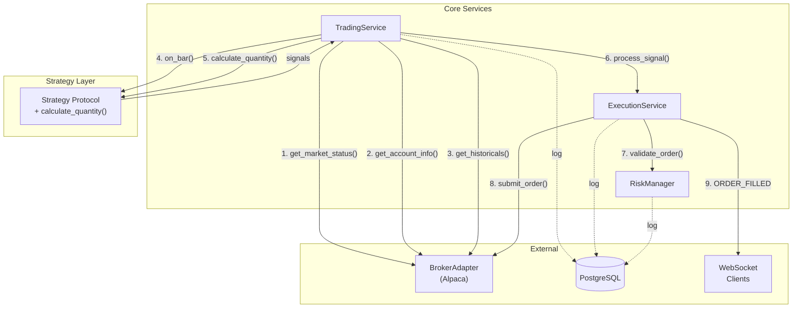
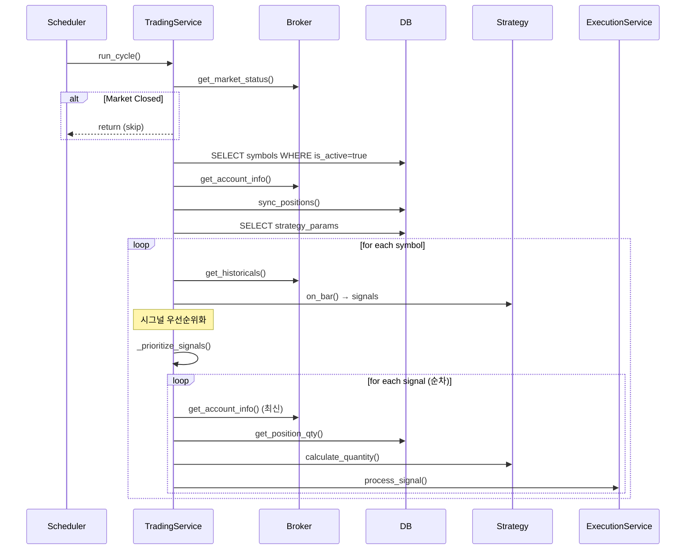

# AutoBuySell 거래 서비스 내부 동작 상세 (개발자용)

> **대상 독자**: 시스템 내부 동작을 이해하고자 하는 개발자  
> **범위**: 전략에 종속되지 않는 코어 거래 흐름

---

## 목차

1. [아키텍처 개요](#1-아키텍처-개요)
2. [서비스 초기화 흐름](#2-서비스-초기화-흐름)
3. [거래 사이클 상세](#3-거래-사이클-상세)
4. [시그널 처리 파이프라인](#4-시그널-처리-파이프라인)
5. [리스크 관리](#5-리스크-관리)
6. [WebSocket 실시간 스트리밍](#6-websocket-실시간-스트리밍)
7. [데이터베이스 로깅 및 결과 확인](#7-데이터베이스-로깅-및-결과-확인)

---

## 1. 아키텍처 개요



### 핵심 컴포넌트

| 컴포넌트 | 파일 위치 | 역할 |
|----------|-----------|------|
| **TradingService** | [trading.py](../api/app/services/trading.py) | 거래 사이클 오케스트레이션, 시그널 우선순위화 |
| **ExecutionService** | [execution.py](../api/app/services/execution.py) | 단일 시그널 → 주문 실행 |
| **RiskManager** | [risk.py](../api/app/services/risk.py) | 주문 전 리스크 검증 |
| **Strategy** | [base.py](../api/app/strategies/base.py) | 시그널 생성 + 포지션 사이징 |
| **BrokerAdapter** | [alpaca.py](../api/app/brokers/alpaca.py) | 브로커 API 추상화 |

---

## 2. 서비스 초기화 흐름

### 2.1 FastAPI Lifespan

```python
@asynccontextmanager
async def lifespan(app: FastAPI):
    # 1. DB 테이블 생성
    async with engine.begin() as conn:
        await conn.run_sync(Base.metadata.create_all)
    
    # 2. 서비스 인스턴스 생성
    broker = AlpacaBroker()
    risk_manager = RiskManager()
    execution_service = ExecutionService(broker, risk_manager)
    trading_service = TradingService(broker, execution_service)
    
    # 3. 상태 복원 (DB에서 is_running, active_strategy 로드)
    await trading_service.restore_state()
    
    yield
    
    # 4. 종료 시 스케줄러 정리
    await trading_service.stop(persist=False)
```

### 2.2 상태 복원

서버 재시작 시 DB에서 이전 상태 복원:

```sql
SELECT value FROM system_state WHERE key = 'trading_is_running';
SELECT value FROM system_state WHERE key = 'trading_active_strategy';
```

---

## 3. 거래 사이클 상세

### 3.1 스케줄러

```python
self.scheduler.add_job(
    self.run_cycle,
    IntervalTrigger(minutes=1),  # 1분마다 실행
    id="trading_cycle"
)
```

### 3.2 run_cycle() 흐름



### 3.3 시그널 우선순위화

```python
def _prioritize_signals(self, signals):
    """
    1. SELL/EXIT 먼저 (현금 확보)
    2. BUY를 confidence 높은 순
    """
    sell_signals = [s for s in signals if s.type in (SignalType.SELL, SignalType.EXIT)]
    buy_signals = [s for s in signals if s.type == SignalType.BUY]
    
    buy_signals.sort(key=lambda s: s.confidence, reverse=True)
    
    return sell_signals + buy_signals
```

**이유:**
- SELL 먼저 → 현금 확보 → BUY 시 더 많은 구매력 활용
- confidence 높은 BUY 먼저 → 가장 확신 있는 기회 우선

---

## 4. 시그널 처리 파이프라인

### 4.1 StrategySignal 구조

```python
class StrategySignal(BaseModel):
    symbol: str
    type: SignalType         # BUY, SELL, EXIT, HOLD
    confidence: float        # 0.5 ~ 2.0
    timestamp: datetime
    metadata: Dict[str, Any]
    strategy_name: str
    qty: float = 0.0         # 전략에서 계산됨
```

### 4.2 순차 처리 루프

```python
for signal in self._prioritize_signals(signals):
    # 1. 최신 계좌 조회 (이전 주문으로 잔액 변경됨)
    account = await self.broker.get_account_info()
    position_qty = await self._get_position_qty(db, signal.symbol)
    
    # 2. 포지션 사이징 (전략에서 계산)
    signal.qty = strategy.calculate_quantity(signal, account, position_qty)
    
    # 3. 실행 (단일 시그널)
    await self.execution.process_signal(db, signal)
```

> [!IMPORTANT]
> 각 시그널 처리 전에 **계좌 정보를 다시 조회**합니다.  
> 이전 주문 실행으로 잔액이 변경되었을 수 있기 때문입니다.

### 4.3 포지션 사이징 (Strategy 내부)

각 전략은 자체 `calculate_quantity()` 로직을 구현:

```python
# MeanReversionStrategy.calculate_quantity()
def calculate_quantity(self, signal, account, current_position_qty):
    target_value = self.params.get('target_value', 1000.0)
    limit = self.params.get('limit', 1000.0)
    
    current_position_value = current_position_qty * current_price
    value_diff = target_value - current_position_value
    
    if signal.type == SignalType.BUY:
        amount = pow(2, value_diff / target_value) * signal.confidence * (target_value / 5)
        amount = min(amount, account.buying_power, limit)
        return amount / current_price
    
    elif signal.type == SignalType.SELL:
        amount = pow(2, -value_diff / target_value) * signal.confidence * (target_value / 5)
        amount = min(amount, limit)
        return min(amount / current_price, current_position_qty)
```

### 4.4 ExecutionService.process_signal()

```python
async def process_signal(self, db, signal):
    if signal.type == SignalType.HOLD:
        return
    
    qty = signal.qty  # 전략에서 이미 계산됨
    
    if qty <= 0:
        return
    
    # OrderRequest 생성
    order_req = OrderRequest(
        symbol=signal.symbol,
        qty=qty,
        side='buy' if signal.type == SignalType.BUY else 'sell',
        type='market'
    )
    
    # 리스크 검증
    await self.risk.validate_order(db, account, order_req, price_estimate)
    
    # 브로커 주문 제출
    result = await self.broker.submit_order(order_req)
    
    # DB 기록 + WebSocket 브로드캐스트
    await manager.broadcast({"type": "ORDER_FILLED", ...})
```

---

## 5. 리스크 관리

### 5.1 검증 로직

```python
async def validate_order(self, db, account, order, price_estimate):
    estimated_cost = order.qty * price_estimate
    
    # 1. 구매력 체크
    if order.side == 'buy' and estimated_cost > account.buying_power:
        raise RiskException("Insufficient buying power")
    
    # 2. 최대 주문 금액 체크 (기본: $10,000)
    if estimated_cost > self.max_order_value:
        raise RiskException("Exceeds max order value")
```

### 5.2 거부 처리

RiskException 발생 시:
- `log_system` 테이블에 WARN 레벨로 기록
- 해당 시그널은 스킵, 다음 시그널 처리 계속

---

## 6. WebSocket 실시간 스트리밍

### 6.1 연결 엔드포인트

```
ws://localhost:8000/api/v1/ws/stream
```

### 6.2 이벤트 타입

| 이벤트 | 발생 시점 | 용도 |
|--------|----------|------|
| `ORDER_FILLED` | 주문 체결 시 | 대시보드 자동 갱신 |
| `BACKTEST_PROGRESS` | 백테스트 진행 중 (매 5일) | 진행률 표시 |
| `BACKTEST_COMPLETED` | 백테스트 완료/실패 | 결과 로드 트리거 |

### 6.3 ORDER_FILLED (거래 체결)

```json
{
    "type": "ORDER_FILLED",
    "data": {
        "symbol": "AAPL",
        "side": "buy",
        "qty": 5.0,
        "status": "accepted",
        "timestamp": "2026-01-03T14:00:00"
    }
}
```

**프론트엔드 처리:**
```typescript
if (msg.type === 'ORDER_FILLED') {
    fetchData();  // 계좌/포지션 자동 갱신
}
```

### 6.4 BACKTEST_PROGRESS (백테스트 진행)

```json
{
    "type": "BACKTEST_PROGRESS",
    "data": {
        "run_id": "abc-123",
        "progress": 45.5,
        "current_date": "2025-06-15",
        "trades_so_far": 12,
        "current_equity": 10523.40
    }
}
```

**프론트엔드 처리:**
```typescript
if (msg.type === 'BACKTEST_PROGRESS') {
    setProgress(msg.data.progress);
    setCurrentEquity(msg.data.current_equity);
}
```

### 6.5 BACKTEST_COMPLETED (백테스트 완료)

**성공 시:**
```json
{
    "type": "BACKTEST_COMPLETED",
    "data": {
        "run_id": "abc-123",
        "status": "COMPLETED",
        "total_return": 15.23,
        "total_trades": 42,
        "final_equity": 11523.45
    }
}
```

**실패 시:**
```json
{
    "type": "BACKTEST_COMPLETED",
    "data": {
        "run_id": "abc-123",
        "status": "FAILED",
        "error": "Not enough data for backtest"
    }
}
```

**프론트엔드 처리:**
```typescript
if (msg.type === 'BACKTEST_COMPLETED') {
    if (msg.data.status === 'COMPLETED') {
        fetchResults(msg.data.run_id);
    } else {
        showError(msg.data.error);
    }
}
```

**기존 사용 범위:**
- 주문 체결 시 계좌 정보(equity, positions) 자동 갱신
- 콘솔 로깅

---

## 7. 데이터베이스 로깅 및 결과 확인

### 7.1 로그 테이블

| 테이블 | 용도 |
|--------|------|
| `log_system` | 시스템 로그 (INFO, WARN, ERROR) |
| `log_signals` | 시그널 기록 (전략명, 심볼, confidence, qty) |
| `orders` | 주문 기록 |
| `system_state` | 거래 상태 영속화 |

### 7.2 API 조회

```bash
# 시그널 로그
curl "http://localhost:8000/api/v1/logs/signals?limit=50"

# 시스템 로그
curl "http://localhost:8000/api/v1/logs/system?limit=50&level=INFO"

# 주문 내역
curl "http://localhost:8000/api/v1/logs/orders?limit=20"
```

### 7.3 Docker 로그

```bash
docker-compose logs -f api
```

---

## 부록: 타임라인 예시

```
14:00:00.000 | [Scheduler] run_cycle() 시작
14:00:00.050 | [Broker] get_market_status() → is_open=true
14:00:00.100 | [DB] SELECT symbols → [AAPL, MSFT, TSLA]
14:00:00.150 | [Broker] get_account_info() → portfolio=$100,000
14:00:00.200 | [DB] sync_positions
14:00:00.250 | [DB] SELECT strategy_params

14:00:00.300 | [Broker] get_historicals(AAPL)
14:00:00.450 | [Strategy] on_bar() → [SELL AAPL conf=1.0, BUY AAPL conf=0.8]
14:00:00.460 | [TradingService] _prioritize_signals() → [SELL, BUY]

14:00:00.470 | --- Signal 1: SELL AAPL ---
14:00:00.480 | [Broker] get_account_info() → $50,000 cash
14:00:00.490 | [Strategy] calculate_quantity() → 10주
14:00:00.500 | [RiskManager] validate_order() → APPROVED
14:00:00.550 | [Broker] submit_order(SELL 10) → Filled
14:00:00.560 | [WebSocket] broadcast ORDER_FILLED

14:00:00.570 | --- Signal 2: BUY AAPL ---
14:00:00.580 | [Broker] get_account_info() → $51,500 cash (SELL 반영)
14:00:00.590 | [Strategy] calculate_quantity() → 5주
14:00:00.600 | [RiskManager] validate_order() → APPROVED
14:00:00.650 | [Broker] submit_order(BUY 5) → Filled
14:00:00.660 | [WebSocket] broadcast ORDER_FILLED

14:00:00.700 | [Broker] get_historicals(MSFT)
...
14:00:01.500 | [Scheduler] run_cycle() 완료
```

---

## 관련 문서

- [시스템 운영 가이드](./SYSTEM_OPERATION.md)
- [전략 개발 가이드](./strategies/README.md)
- [Mean Reversion 전략](./strategies/mean_reversion_v1.md)
