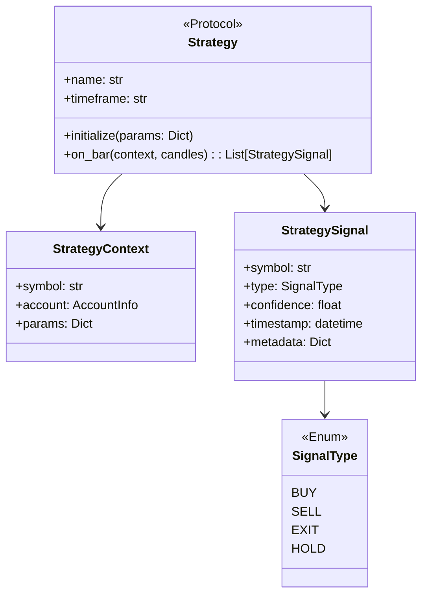

# 전략 개발 가이드

이 문서는 AutoBuySell 시스템에 새로운 거래 전략을 추가하는 방법을 설명합니다.

## 전략 목록

| 전략 이름 | 설명 | 문서 |
|-----------|------|------|
| MeanReversion_v1 | 평균 회귀 전략 | [상세 문서](./mean_reversion_v1.md) |

---

## 전략 아키텍처



---

## 새 전략 추가하기

### 1. 전략 클래스 생성

`api/app/strategies/` 폴더에 새 파일 생성:

```python
# api/app/strategies/my_strategy.py

from typing import List, Dict, Any
from datetime import datetime

from app.strategies.base import Strategy, StrategyContext, StrategySignal, SignalType
from app.domain.models import Candle

class MyStrategy(Strategy):
    """전략 설명을 여기에 작성"""
    
    def __init__(self):
        self._name = "MyStrategy_v1"
        self._timeframe = "1Hour"  # 캔들 타임프레임
        self.params = {
            "timeframe": "1Hour",
            "param1": 10,
            "param2": 0.05,
            # ... 기타 파라미터
        }
    
    @property
    def name(self) -> str:
        return self._name
    
    @property
    def timeframe(self) -> str:
        return self.params.get("timeframe", self._timeframe)
    
    async def initialize(self, params: Dict[str, Any]):
        """DB에서 로드된 파라미터로 초기화"""
        self.params.update(params)
    
    async def on_bar(self, context: StrategyContext, candles: List[Candle]) -> List[StrategySignal]:
        """
        매 캔들마다 호출됨.
        
        Args:
            context: 현재 심볼, 계좌 정보 등
            candles: 최근 캔들 데이터 (최신이 마지막)
        
        Returns:
            생성된 시그널 리스트 (없으면 빈 리스트)
        """
        if not candles or len(candles) < self.params["param1"]:
            return []
        
        signals = []
        
        # 여기에 전략 로직 구현
        # ...
        
        if should_buy:
            signals.append(StrategySignal(
                symbol=context.symbol,
                type=SignalType.BUY,
                confidence=1.0,  # 0.5 ~ 2.0
                timestamp=datetime.now(),
                metadata={
                    "reason": "Buy reason",
                    "current_price": float(current_price),
                    "moving_avg": float(moving_avg),
                    # 포지션 사이징에 필요한 값들
                    "max_position_pct": 0.20,
                    "target_value": 1000.0,
                    "limit": 1000.0
                }
            ))
        
        return signals
```

### 2. TradingService에 전략 등록

`api/app/services/trading.py`에서 전략 추가:

```python
from app.strategies.my_strategy import MyStrategy

class TradingService:
    def __init__(self, ...):
        # ...
        self.strategies = {
            "MeanReversion_v1": MeanReversionStrategy(),
            "MyStrategy_v1": MyStrategy(),  # 새 전략 추가
        }
```

### 3. DB에 전략 메타데이터 등록

```sql
INSERT INTO strategies (id, name, description, class_path, created_at, updated_at)
VALUES (
    gen_random_uuid(),
    'MyStrategy_v1',
    '전략 설명',
    'app.strategies.my_strategy.MyStrategy',
    NOW(),
    NOW()
);
```

### 4. 기본 파라미터 설정

```sql
INSERT INTO strategy_params (id, strategy_name, version, symbol, params, is_active, created_at, updated_at)
VALUES (
    gen_random_uuid(),
    'MyStrategy_v1',
    1,
    NULL,  -- NULL = 기본 설정, 심볼 지정 시 해당 심볼에만 적용
    '{"timeframe": "1Hour", "param1": 10, "param2": 0.05}'::jsonb,
    true,
    NOW(),
    NOW()
);
```

---

## 시그널 메타데이터 필수 필드

포지션 사이징이 제대로 동작하려면 `metadata`에 다음 필드가 필요합니다:

| 필드 | 타입 | 설명 |
|------|------|------|
| `current_price` | float | 현재 가격 (필수) |
| `moving_avg` | float | 이동 평균 (포지션 사이징용) |
| `max_position_pct` | float | 최대 포지션 비율 (기본: 0.20) |
| `target_value` | float | 목표 포지션 가치 (기본: 1000.0) |
| `limit` | float | 최대 주문 금액 (기본: 1000.0) |

---

## 백테스트

새 전략을 프로덕션에 배포하기 전에 백테스트 실행:

```bash
curl -X POST http://localhost:8000/api/v1/backtest/run \
  -H "Content-Type: application/json" \
  -d '{
    "strategy_name": "MyStrategy_v1",
    "symbols": ["AAPL", "MSFT"],
    "start_date": "2025-01-01",
    "end_date": "2025-12-31",
    "initial_capital": 100000,
    "params": {
      "param1": 10,
      "param2": 0.05
    }
  }'
```

---

## 전략 전환

API를 통해 활성 전략을 변경할 수 있습니다:

```bash
curl -X PUT http://localhost:8000/api/v1/trading/strategy \
  -H "Content-Type: application/json" \
  -d '{"strategy_name": "MyStrategy_v1"}'
```

> [!NOTE]
> 전략 변경은 즉시 적용되며, 다음 거래 사이클부터 새 전략이 사용됩니다.
> 변경 내역은 DB에 저장되어 서버 재시작 후에도 유지됩니다.
