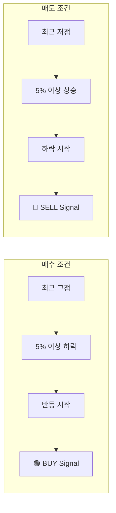

# Mean Reversion 전략 (v1)

**전략 이름:** `MeanReversion_v1`  
**파일 위치:** [`api/app/strategies/mean_reversion.py`](file:///home/tglim/codes/AutoBuySell/api/app/strategies/mean_reversion.py)

---

## 개요

Mean Reversion (평균 회귀) 전략은 주가가 평균에서 크게 벗어났을 때 다시 평균으로 회귀하는 경향을 이용합니다.

### 핵심 원리

1. **매수 (Dip Buy):** 최근 고점에서 크게 하락한 후 반등 시작 시점에 매수
2. **매도 (Peak Sell):** 최근 저점에서 크게 상승한 후 하락 시작 시점에 매도



---

## 파라미터

| 파라미터 | 기본값 | 설명 |
|----------|--------|------|
| `timeframe` | `30Min` | 캔들 타임프레임 |
| `duration` | `24` | Lookback 기간 (캔들 개수) |
| `thr_buy` | `0.05` | 매수 임계값 (5% 하락) |
| `thr_sell` | `0.05` | 매도 임계값 (5% 상승) |
| `rebound` | `0.0` | 반등/하락 확인 임계값 |
| `target_value` | `1000.0` | 목표 포지션 가치 (USD) |
| `limit` | `1000.0` | 최대 주문 금액 (USD) |
| `price_type` | `open` | 사용 가격 (`open` 또는 `close`) |

---

## 시그널 생성 로직

### 매수 조건 (BUY)

```python
# 1. 가격이 최근 고점 대비 충분히 하락했는가?
is_deep_enough = (1 - thr_buy) * max_price >= current_price

# 2. 가격이 반등 중인가?
is_rebounding = (1 + rebound) * prev_price <= current_price

# 두 조건 모두 충족 시 BUY 시그널
if is_deep_enough and is_rebounding:
    # Generate BUY signal
```

**예시 (thr_buy=0.05, rebound=0.0):**
- 최근 24캔들 고점: $100
- 현재 가격: $94 (6% 하락)
- 이전 가격: $93
- 조건 1: `(1 - 0.05) * 100 = 95 >= 94` ✓
- 조건 2: `(1 + 0) * 93 = 93 <= 94` ✓
- **→ BUY 시그널 발생**

### 매도 조건 (SELL)

```python
# 1. 가격이 최근 저점 대비 충분히 상승했는가?
is_high_enough = (1 + thr_sell) * min_price <= current_price

# 2. 가격이 하락 중인가?
is_pullback = (1 - rebound) * prev_price >= current_price

# 두 조건 모두 충족 시 SELL 시그널
if is_high_enough and is_pullback:
    # Generate SELL signal
```

**예시 (thr_sell=0.05, rebound=0.0):**
- 최근 24캔들 저점: $90
- 현재 가격: $96 (6.67% 상승)
- 이전 가격: $97
- 조건 1: `(1 + 0.05) * 90 = 94.5 <= 96` ✓
- 조건 2: `(1 - 0) * 97 = 97 >= 96` ✓
- **→ SELL 시그널 발생**

---

## 신뢰도 (Confidence) 계산

시그널 강도를 나타내는 confidence 값은 0.5 ~ 2.0 범위로 계산됩니다:

### 매수 신뢰도
```python
raw_conf = pow(2, (1 - current_price / max_price) / thr_buy - 2)
confidence = max(0.5, min(raw_conf, 2.0))
```

- 하락폭이 클수록 confidence 증가
- `thr_buy` 대비 2배 하락 시 confidence = 1.0
- `thr_buy` 대비 3배 하락 시 confidence = 2.0

### 매도 신뢰도
```python
raw_conf = pow(2, (current_price / min_price - 1) / thr_sell - 2)
confidence = max(0.5, min(raw_conf, 2.0))
```

---

## 파라미터 튜닝 가이드

### 공격적인 설정 (더 많은 거래)

```json
{
    "duration": 12,
    "thr_buy": 0.03,
    "thr_sell": 0.03,
    "rebound": 0.0
}
```

- 짧은 lookback → 더 빈번한 트리거
- 낮은 임계값 → 작은 움직임에도 반응

### 보수적인 설정 (적은 거래, 높은 확신)

```json
{
    "duration": 48,
    "thr_buy": 0.08,
    "thr_sell": 0.08,
    "rebound": 0.01
}
```

- 긴 lookback → 더 큰 추세 확인
- 높은 임계값 → 큰 움직임에만 반응
- rebound 추가 → 반등/하락 확인 필수

### 심볼별 파라미터 오버라이드

변동성이 높은 심볼은 더 높은 임계값 설정:

```sql
-- TSLA 전용 파라미터 (변동성 높음)
INSERT INTO strategy_params (id, strategy_name, version, symbol, params, is_active, created_at, updated_at)
VALUES (
    gen_random_uuid(),
    'MeanReversion_v1',
    1,
    'TSLA',  -- 심볼 지정
    '{"duration": 24, "thr_buy": 0.08, "thr_sell": 0.08}'::jsonb,
    true,
    NOW(),
    NOW()
);
```

---

## 백테스트 실행

### API를 통한 백테스트

```bash
curl -X POST http://localhost:8000/api/v1/backtest/run \
  -H "Content-Type: application/json" \
  -d '{
    "strategy_name": "MeanReversion_v1",
    "symbols": ["AAPL", "MSFT", "NVDA"],
    "start_date": "2025-01-01",
    "end_date": "2025-12-31",
    "initial_capital": 100000,
    "params": {
        "duration": 24,
        "thr_buy": 0.05,
        "thr_sell": 0.05,
        "rebound": 0.0
    }
  }'
```

### 백테스트 결과 확인

```bash
# 실행 ID로 결과 조회
curl http://localhost:8000/api/v1/backtest/{run_id}/results
```

**결과 예시:**
```json
{
    "total_return": 15.23,
    "max_drawdown": -8.5,
    "win_rate": 0.62,
    "total_trades": 47,
    "equity_curve": [...]
}
```

---

## 주의사항

> [!WARNING]
> **시장 상황에 따른 성과 차이**
> - 횡보장에서 좋은 성과
> - 강한 추세장에서는 역추세 진입으로 손실 가능
> - 급등/급락장에서 손절 필요

> [!CAUTION]
> **실거래 전 필수 점검**
> 1. 충분한 백테스트 수행
> 2. 페이퍼 트레이딩으로 검증
> 3. 소액으로 시작하여 점진적 증액

---

## 관련 코드

- [mean_reversion.py](file:///home/tglim/codes/AutoBuySell/api/app/strategies/mean_reversion.py) - 전략 구현
- [base.py](file:///home/tglim/codes/AutoBuySell/api/app/strategies/base.py) - Strategy Protocol 정의
- [execution.py](file:///home/tglim/codes/AutoBuySell/api/app/services/execution.py) - 시그널 실행 로직
- [position_sizer.py](file:///home/tglim/codes/AutoBuySell/api/app/services/position_sizer.py) - 포지션 사이징
